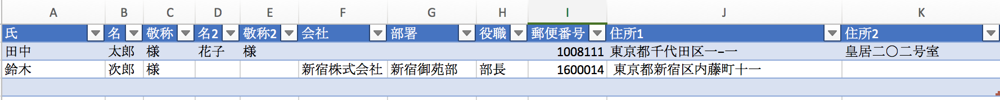
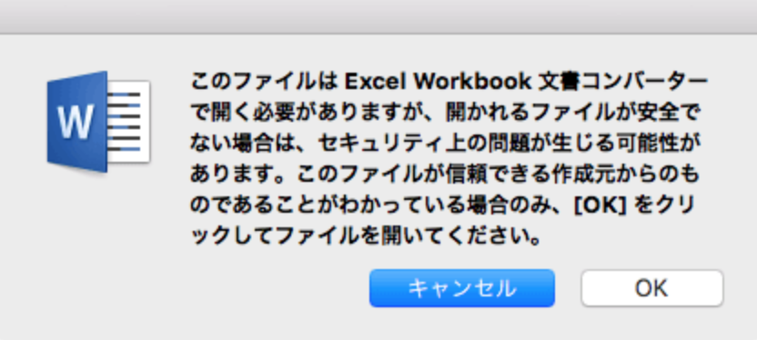
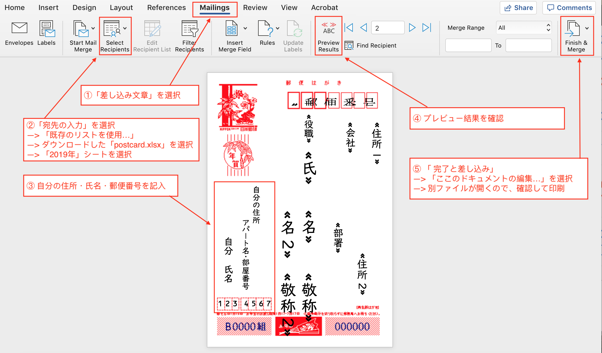
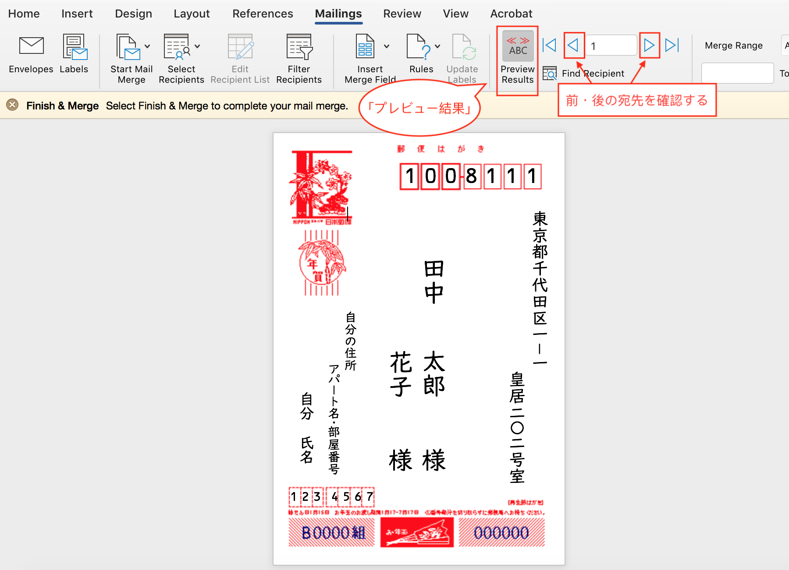
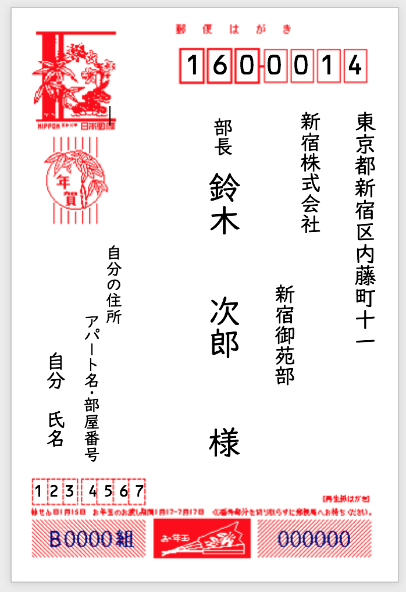
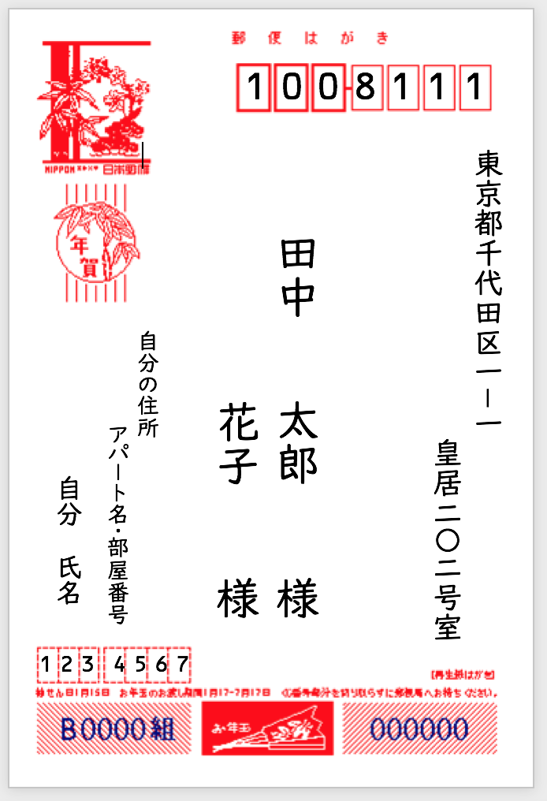

# [postcard] 年賀状の宛先自動入力をMicrosoft Excel & Word for Macで無料で作る

作成日：2019年1月27日

## はじめに

近年は紙媒体の年賀状を個人間で送り合う文化も薄れてきたように感じましたが、結婚式などを機に友人から年賀状が届くなるようになりました。今後も考えると生産性を考えて年賀状の宛先の自動入力ソフトを、お馴染みにエクセルとワードで作ってみました。

## 環境\&使用ソフト

Mac OS High Sierra (10.13.6)

- Microsoft Word 2018 for Mac
- Microsoft Excel 2018 for Mac

## テンプレート

**連名**が可能で、**会社関係**の方にも使用できるテンプレートになっています。

### 1.エクセルの準備

テンプレートを以下からダウンロードして、宛先を記入してください。

**エクセルテンプレートのダウンロード** → [https://github.com/xenial-ovis/postcard/blob/master/postcard.docx](https://github.com/xenial-ovis/postcard/blob/master/postcard.xlsx) 
(「View Raw」あるいは「Download」を押すとダウンロードできます）

#### エクセルテンプレートの説明

- **氏**：苗字
- **名**: 名前
- **敬称**: 敬称 (様・御中)
- **名2**: 連名者の名前
- **敬称2**: 連名者の敬称 (様・御中)
- **会社**: 会社名
- **部署**: 部署名
- **郵便番号**: 郵便番号(「ー (ハイフン) 」なしの7桁）
- **住所1**: 県庁所在地・区市町村・番地
- **住所2**: アパート名・部屋番号

※ 記入する必要のない項目は、空欄にしておいてください。  
※ 数字は、漢字で記入してください（そうでなければ横書きになります）。

### 2.ワードの準備

テンプレートを以下からダウンロードして、5つの手順で作成を進めてください。

**ワードテンプレートのダウンロード** → [https://github.com/xenial-ovis/postcard/blob/master/postcard.docx](https://github.com/xenial-ovis/postcard/blob/master/postcard.docx)   
(「View Raw」あるいは「Download」を押すとダウンロードできます）

※ ワードを開く際に以下のメッセージが出るときがあるので「OK」を洗濯してください。

#### ワードテンプレートと手順

① 「差し込み文書」を選択する  
② 「宛先の入力」＞「既存のリストの選択...」を選択し、先ほどダウンロードした「postcard.xlsx」を洗濯し、「2019年」シートを選択する  
③ 赤枠に自分の住所などを直接記入する  
④ プレビュー結果を記入して、差し込みがうまくいっているか確認する

  
⑤ プレビュー結果がよければ、「差し込みと完了」＞「個々のドキュメントの編集...」を選択すると、別ウィンドウが開くので、一つ一つの宛先について微修正を行うことができる。編集が終われば、片面印刷する

#### サンプル例（プレビュー結果）

----

以上になります。  
質問・コメントなどあれば気軽にご連絡ください！
